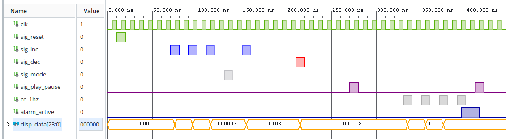
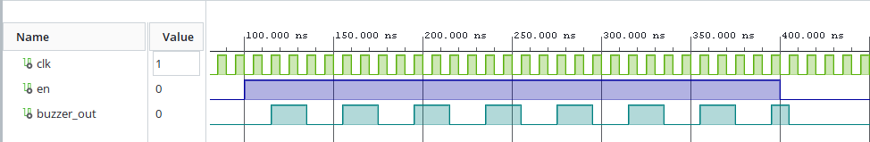
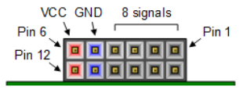
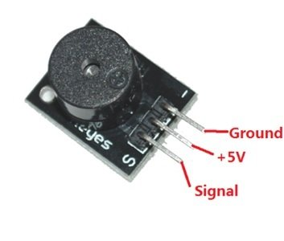
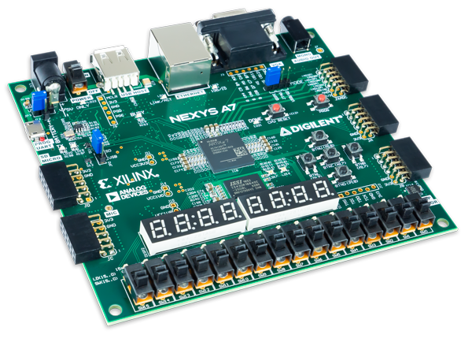
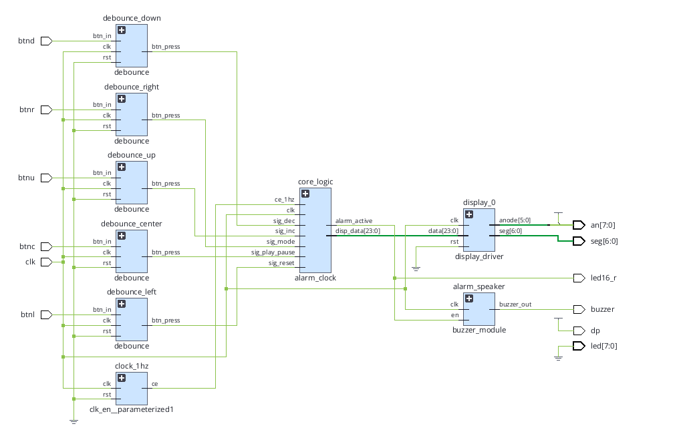

# BPC-DE1-Project Alarm clock
Project for the bachelor subject Digital Electronics 1, 2026 <br>

##  Main objective
Creation of a working alarm clock. The maximum amount of time set being a whole day (23.59.59 <=> HH.MM.SS). After the time runs out, colored diode lights up and buzzer starts buzzing. The user should be able to increase/decrease time either by seconds, minutes and hours. After setting time and running the alarm clock, the user is blocked to manipulate the time (unless the time is stopped).

### List of used hardware components of the board
| Component | Function |
| :--- | :----- |
| `BTNU` - Up button | Increases time value |
| `BTND` - Down button | Decreases time value |
| `BTNC` - Center button | Starts/stops the alarm clock the countdown, stops buzzer noise + the RGB diode after the timer runs out |
| `BTNL` - Left button | Resets the time |
| `BTNR` - Right button | Changes the time incrementation/decrementation (by seconds, minutes, hours) |
| `6x 7-segment displays` | Displays the time in HH.MM.SS format |
| `RGB diode` | Signals output in red when the time runs out |

## Modules
This project contains new custom modules wrapped into  `alarm_clock_top`  top level:
- ```alarm_clock``` ([code](alarm_clock/alarm_clock.srcs/sources_1/new/alarm_clock.vhd))
- ```buzzer_module``` ([code](alarm_clock/alarm_clock.srcs/sources_1/new/buzzer_module.vhd))

It also uses already existing modules from the https://github.com/tomas-fryza/vhdl-examples repository
- [```bin2seg```](https://github.com/tomas-fryza/vhdl-examples/tree/master/lab3-segment) (modified, only note-worthy difference being the default number being set to 0: seg <= 0000001) ([code](alarm_clock/alarm_clock.srcs/sources_1/imports/imports/new/bin2seg.vhd))
- [```clk_en```](https://github.com/tomas-fryza/vhdl-examples/tree/master/lab4-counter) (docs included within the counter .md file) (unchanged) ([code](alarm_clock/alarm_clock.srcs/sources_1/imports/imports/new/clk_en.vhd))
- [```counter```](https://github.com/tomas-fryza/vhdl-examples/tree/master/lab4-counter) (unchanged) ([code](alarm_clock/alarm_clock.srcs/sources_1/imports/imports/Documents/counter/counter.srcs/sources_1/new/counter.vhd))
- [```display_driver```](https://github.com/tomas-fryza/vhdl-examples/tree/master/lab5-display) (modified, allowing 6 segment displays instead of only 2) ([code](alarm_clock/alarm_clock.srcs/sources_1/imports/imports/new/display_driver.vhd))
- [```debounce```](https://github.com/tomas-fryza/vhdl-examples/tree/master/lab6-debounce) (unchanged) ([code](alarm_clock/alarm_clock.srcs/sources_1/imports/imports/Documents/debounce/debounce.srcs/sources_1/new/debounce.vhd))

Each button uses a different version of debouce module with instantations (hence the top level scheme contains `debounce_up`, `debounce_down`, etc.)

## alarm_clock module

### Background
An alarm clock is used to be an adjustable timer that signals to an user that time has run out. It also requires to have a possible way for an user to input its time values and when to signal the countdown.

### I/O ports of the `alarm_clock` module:
| Port name | Direction | Type | Description |
|:---------|:---------:|:----|:-----------|
| `clk` | in | `std_logic` | Main clock |
| `sig_reset` | in |  `std_logic` | Resets clock to 00.00.00|
| `sig_in` | in |  `std_logic` | Increment time |
| `sig_dec` | in |  `std_logic` | Decrement time |
| `sig_mode` | in |  `std_logic` | Cycle edit mode (sec -> min -> hr) |
| `sig_play_pause` | in |  `std_logic` | Toggle countdown/silence alarm |
| `ce_1hz` | in |  `std_logic` | 1 Hz enable pulse for real-time counting |
| `disp_data` | out |  `std_logic_vector(23 downto 0)` | Packed BCD for displays |
| `alarm_active` | out |  `std_logic` | Activates when timer hits 0 |


Outcome of `alarm_clock_tb`:
<br>
The display of the simulation shows us an example of the alarm clock responding to incoming signals.

The test provides us the following events:
- sig_reset is used to be sure that all used variables for the clock are indeed at the starting values.
- sig_inc (navy blue) gets pushed to increment values of the alarm clock, increasing the output in disp_data from 000000 to 000003 adding 3 seconds, then after switching mode to a 000103 adding a minute
- sig_mode (gray) changes the mode of incrementation/decrementation (ss -> mm -> hh -> ss -> ...), simulation only shows switching from seconds to minutes
- sig_dec (red) decreases the time on the actual alarm clock
- sig_play_pause (violet) is used to signal countdown and eventual stop of the sounds of the buzzer and the led_diode (alarm_active)
- ce_1hz (gray) shows the countdown, before alarm_active is turned on
- alarm_active (dark blue) shows the time when buzzer is blaring and the led diode (red) is glowing

### Conclusion
The test shows us intended change in behaviour for a module that should work as an adjustable alarm clock that signals when time runs out. With the usage of the debounce module its also ensured, that the button mashing (sending signals) will remain consistent.

## buzzer_module module
### Background
The nexys A7 50t board oscilator operates on a 100,000,000 frequency and we desire a 50% duty cycle square wave, which this module achieves

### I/O ports of the `buzzer_module` module:

Table of signals coming into custom module ```buzzer_module ```:
| Port name | Direction | Type | Description |
|:---------|:---------:|:----|:-----------|
| `clk` | in | `std_logic` | Main clock |
| `en` | in | `std_logic` | Enable |
| `buzzer_out` | out | `std_logic` | Buzzer output |

Outcome of `buzzer_module_tb`:
<br>
<i>Requires to manually change the C_MAX value in buzzer_module to 2 for simulation purposes</i>

The test provides us the following events:
- en (dark blue) signals us, that the buzzer should be turned on. In this case the duration is 300 ns
- buzzer_out (teal) the buzzer recieves 50% duty cycle square wave

### Conclusion
The test shows us, that the buzzer recieves 50% duty cycle square wave, when its enabled.

## JA Pmod connectors (Nexys A7)
In the actual realization for the buzzer to be functional, it is neccesary to note which actual port the buzzer (in our case HW508) should be connected. The constraint file is set to expect the buzzer in port C17:

`set_property -dict { PACKAGE_PIN C17 IOSTANDARD LVCMOS33 } [get_ports {buzzer}];`

   | Pin | Signal | FPGA Pin | Description  |
   | :--: | :---- | :------- | :----------- |
   | 1   | JA1    | C17      | Data / IO    |

<br>
<i>Pmod connectors for nexys A7 50t</i>

<br>
<i>Reference on the buzzer pinout</i><br>
It is expected to connect the buzzer Signal pin to the rightmost corner of the JA pinout, the middle +5V pin to VCC pinout and the Ground on the GND pinout.


## Used hardware
The code runs on the <b>Nexys A7-50T</b> FPGA board.
<br>
<i>Note: The board in question.</i>

## Top level schematics

<br>
<i>RTL analysis Schematic</i>

The top level being called ```alarm_clock_top.vhd``` <br>
<br>
<i>Top level scheme</i>

## References
1. Digilent blog. [Nexys A7 Reference Manual](https://reference.digilentinc.com/reference/programmable-logic/nexys-a7/reference-manual)

2. Diligent. [General .xdc file for the Nexys A7-50T](https://github.com/Digilent/digilent-xdc/blob/master/Nexys-A7-50T-Master.xdc)

3. Tomas Fryza, vhdl-examples. [VHDL examples](https://github.com/tomas-fryza/vhdl-examples/tree/master)

4. Microcontrollerslab. [Image for the buzzer pinouts](https://microcontrollerslab.com/buzzer-module-interfacing-arduino-sound-code/)
